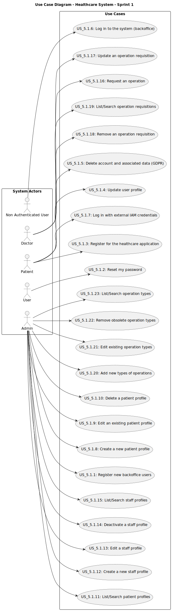

# Use Case Diagram (UCD)

# Use Cases / User Stories

## Sprint 1

# User Stories

| User Story  | Description  | Acceptance Criteria | Priority |
|-------------|--------------|---------------------|------------|
| **5.1.1** | As a customer, I want to view the list of available products. | - The product list must display all available products.   - Each product must include an image, name, price, and brief description. | 1 |
| **5.1.2** | As a customer, I want to filter products by category. | - The filter must allow selection of one or multiple categories.   - The product list must update to show only products that match the selected categories. | 1 |
| **5.1.3** | As a customer, I want to search for products by name. | - A search bar must be present on the product list page.   - The product list must update to show only products that match the search term. | 1 |
| **5.1.4** | As a customer, I want to sort products by price. | - The sorting option must allow sorting in ascending and descending order.   - The product list must update to reflect the selected sorting order. | 1 |
| **5.1.5** | As a customer, I want to view product details. | - Clicking on a product must redirect to the product detail page.   - The product detail page must display a larger image, detailed description, specifications, and customer reviews. | 1 |
| **5.1.6** | As a customer, I want to add products to my shopping cart. | - Each product must have an "Add to Cart" button.   - Adding a product must update the cart icon to reflect the new quantity. | 1 |
| **5.1.7** | As a customer, I want to view my shopping cart. | - A cart icon must be visible on every page.   - Clicking on the cart icon must redirect to the shopping cart page displaying all added items. | 1 |
| **5.1.8** | As a customer, I want to update the quantity of products in my cart. | - Each item in the cart must have an input field for quantity.   - Changing the quantity must update the total price in real-time. | 1 |
| **5.1.9** | As a customer, I want to remove products from my shopping cart. | - Each item in the cart must have a "Remove" button.   - Removing an item must update the cart total immediately. | 1 |
| **5.1.10** | As a customer, I want to proceed to checkout. | - The checkout button must be clearly visible on the cart page.   - Clicking on the checkout button must redirect to the checkout page. | 1 |
| **5.1.11** | As a customer, I want to enter my shipping information during checkout. | - The checkout page must include fields for name, address, city, state, and postal code.   - All fields must be required for submission. | 1 |
| **5.1.12** | As a customer, I want to select a payment method. | - The checkout page must provide options for credit/debit card, PayPal, and other payment methods.   - Selecting a payment method must display relevant input fields. | 2 |
| **5.1.13** | As a customer, I want to review my order before finalizing the purchase. | - A summary of the order must be displayed on the checkout page.   - The summary must include products, quantities, prices, and total cost. | 2 |
| **5.1.14** | As a customer, I want to receive an order confirmation email. | - An order confirmation email must be sent after successful payment.   - The email must include order details and a receipt. | 2 |
| **5.1.15** | As a customer, I want to view my order history. | - A link to "My Orders" must be available in the user account section.   - The order history page must display a list of past orders with details. | 2 |
| **5.1.16** | As a customer, I want to track the status of my orders. | - Each order in the order history must include a tracking link if applicable.   - The tracking link must redirect to the shipping carrier's tracking page. | 1 |
| **5.1.17** | As a customer, I want to contact customer support. | - A "Contact Us" link must be available on the website.   - The contact page must include a form to submit inquiries and display contact information. | 1 |
| **5.1.18** | As a customer, I want to view FAQs. | - A link to the FAQ section must be available on the website.   - The FAQ section must provide answers to common questions. | 1 |
| **5.1.19** | As a customer, I want to manage my account settings. | - The user account section must allow users to update their profile information, including password changes.   - Changes must be saved and confirmed with a message. | 1 |
| **5.1.20** | As a customer, I want to log out of my account. | - A "Log Out" button must be available in the user account section.   - Clicking "Log Out" must redirect the user to the homepage. | 2 |
| **5.1.21** | As a customer, I want to receive promotional offers. | - Customers must have the option to subscribe to promotional emails during account registration.   - Promotional offers must be clearly displayed on the website. | 2 |
| **5.1.22** | As a customer, I want to leave reviews for products. | - Each product detail page must include a section for customer reviews.   - Users must be able to submit a review after purchasing the product. | 2 |
| **5.1.23** | As a customer, I want to return products. | - The return policy must be clearly stated on the website.   - A return request form must be available in the user account section. | 2 |

## Sprint 2

| User Story | Description | Acceptance Criteria | Priority |
|------------|-------------|---------------------|----------|
|            |             |                     |          |

## Sprint 3

| User Story | Description | Acceptance Criteria | Priority |
|------------|-------------|---------------------|----------|
|            |             |                     |          |
